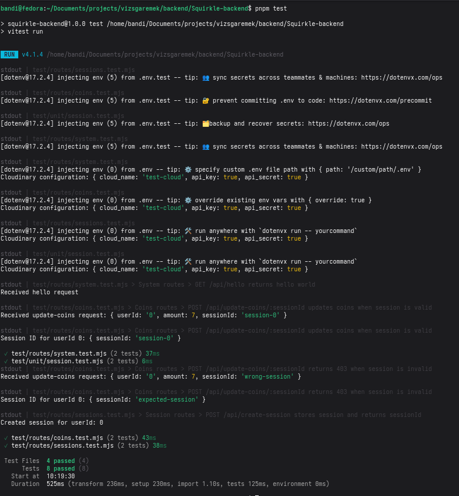
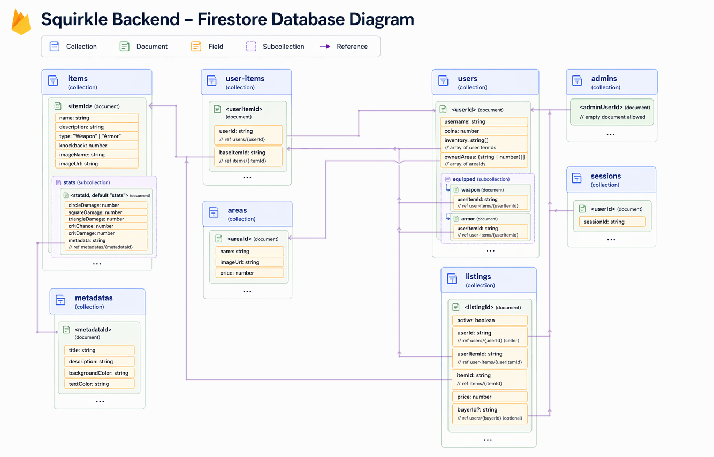

# Squirkle Backend API

A Squirkle backend szolgáltatása, amely Express, Firebase Firestore és Cloudinary használatával készült.

## Áttekintés

- Futási környezet: Node.js (CommonJS)
- Keretrendszer: Express 5
- Adatbázis: Firebase Firestore (`firebase-admin` segítségével)
- Fájl tárolás: Cloudinary
- Feltöltés feldolgozó: Multer (memória tárolás)
- Helyi alapértelmezett URL: `http://localhost:3333`

## Kapcsolódó Repozitóriumok

- Frontend: https://github.com/SagiBeno/Squirkle-frontend
- Játék: https://github.com/KristoffRed/Squirkle-Unity

## Telepítés

- Backend URL: https://squirkle-backend.vercel.app/

## Gyors Indítás

1. Függőségek telepítése:

```bash
pnpm install
```

2. `.env` fájl létrehozása:

```env
FIREBASE_SERVICE_ACCOUNT={"type":"service_account",...}
FIREBASE_DATABASE_URL=https://<your-project>.firebaseio.com

CLOUDINARY_CLOUD_NAME=<cloudinary_cloud_name>
CLOUDINARY_API_KEY=<cloudinary_api_key>
CLOUDINARY_API_SECRET=<cloudinary_api_secret>
```

3. Szerver indítása:

```bash
node index.cjs
```

Megjegyzések:
- A `FIREBASE_SERVICE_ACCOUNT` érvényes JSON-ként legyen kódolva egy környezeti változóba.
- Az aktuális port `3333`-ra van kódolva.
- Elérhető parancsok:
    - `pnpm start` futtatja a `node index.cjs`-t
    - `pnpm dev` futtatja a `node --watch index.cjs`-t
    - `pnpm test` egyszer futtatja a Vitest tesztcsomagot
    - `pnpm test:watch` Vitest figyelési módban futtatja
    - `pnpm test:coverage` Vitest lefedettségi kimenettel futtatja

## Tesztelés (Vitest)

Ez a projekt Vitest-et használ Node környezettel és modul-mockokkal a Firebase Admin, Cloudinary és dotenv számára.

Tesztek futtatása:

```bash
pnpm test
```

Futtatás figyelő módban:

```bash
pnpm test:watch
```

Futtatás lefedettséggel:

```bash
pnpm test:coverage
```

### Backend Teszt Képernyőkép



Jelenlegi alap tesztelési kör:
- Munkamenet segédprogram: `generateSessionId`
- Rendszer útvonalak: `GET /api/hello`, `GET /api/server-time`
- Munkamenet útvonal: `POST /api/create-session`

## Hitelesítési és Jogosultsági Modell

Ez az API két hozzáférési mintát használ:

1. Munkamenet-alapú műveletek
- Hozzon létre egy munkamenetet a `POST /api/create-session` segítségével.
- Néhány végpont megköveteli a `:sessionId`-t az URL-ben, és ellenőrzi azt a `sessions/<userId>.sessionId` alapján.

2. Adminisztrátor által korlátozott műveletek
- Az adminisztrátori ellenőrzések a `admins/<userId>` dokumentum létezésének ellenőrzésével történnek.
- Az csak adminisztrátoroknak szánt végpontok `403`-at adnak vissza, ha a felhasználó nem jogosult.

## API Konvenciók

- Alap előtag: `/api`
- JSON a legtöbb végponthoz
- Hiba formátum (tipikus):

```json
{
    "error": "Ember által olvasható hibaüzenet"
}
```

- Néhány végpont explicit üzleti állapotkódokat használ:
    - A felhasználónév létezésének ellenőrzése `409`-et ad vissza `{ "exists": true }`-val
    - Több validációs hiba `400`-at ad vissza

## Üzleti Szabályok

- Az engedélyezett `type` értékek kis- és nagybetű-érzékenyek: `Weapon`, `Armor`
- Az érme frissítési összegének korlátozásai a `POST /api/update-coins/:sessionId`-ben:
    - Numerikus
    - Nagyobb, mint `0`
    - Kisebb vagy egyenlő, mint `1000`

## Firestore Adatmodell

Használt gyűjtemények:

- `users`
    - felhasználói profil mezők (`username`, `coins`, `inventory`)
    - felszerelt tárgyak algyűjtemény: `users/<userId>/equipped/<type>`
- `sessions`
    - `sessions/<userId> { sessionId }`
- `admins`
    - admin felhasználók dokumentumazonosító szerint
- `items`
    - alap tárgy adatok és beágyazott statisztikák algyűjtemény `items/<itemId>/stats/<statsId>`
- `user-items`
    - felhasználónkénti tulajdonolt tárgy példányok
- `listings`
    - aukciósház (`active`, `price`, `userId`, `itemId`, `userItemId`, stb.)
- `metadatas`
    - megosztott metaadat bejegyzések tárgy stílus/ritkaság-szerű adatokhoz
- `areas`
    - megvásárolható világ/zóna bejegyzések (`name`, `imageUrl`, `price`)

### Firestore Adatbázis Diagram



## Függvény Referencia

### `generateSessionId(userId)` => `string`

Egyedi munkamenet-azonosítót generál egy felhasználó számára a felhasználói azonosítója, az aktuális időbélyeg és egy véletlenszerű só alapján.

**Típus**: globális függvény
**Visszatérési érték**: `string` - A generált SHA-256 munkamenet-azonosító.

| Paraméter | Típus    | Leírás                     |
| --------- | -------- | -------------------------- |
| userId    | `string` | A felhasználó azonosítója. |

### `isAdmin(userId)` => `Promise<boolean>`

Ellenőrzi, hogy egy adott felhasználó adminisztrátor-e az `admins` gyűjtemény lekérdezésével.

**Típus**: globális függvény
**Visszatérési érték**: `Promise<boolean>` - `true`-ra oldódik fel, ha a felhasználó admin, egyébként `false`.

| Paraméter | Típus    | Leírás                                    |
| --------- | -------- | ----------------------------------------- |
| userId    | `string` | Az ellenőrizendő felhasználó azonosítója. |

## Végpont Referencia

Helyettesítőkre vonatkozó konvenciók ebben a szakaszban:
- A helyettesítő JSON illusztratív és nem szigorú séma szerződés.
- A mezőnevek és a beágyazott struktúrák útvonal-implementációnként változhatnak.
- A hibaüzenetek általában a `{ "error": "message" }` formátumot követik.

### Rendszer

#### `GET /api/hello` => `HelloResponse`
Összefoglalás: Egészség-ellenőrző végpont.

**Típus**: végpont
**Auth**: Nyilvános

Kérés minta:

```json
{}
```

| Státusz | Jelentés              | Válasz Formátum         | Megjegyzések                     |
| ------- | --------------------- | ----------------------- | -------------------------------- |
| 200     | Szolgáltatás elérhető | `{ "message": string }` | Alapvető API életjel-ellenőrzés. |

Válasz minta (200):

```json
{
    "message": "Hello from Squirkle API"
}
```

#### `GET /api/server-time` => `ServerTimeResponse`
Összefoglalás: Szerveridő eltolás lekérése másodpercben.

**Típus**: végpont
**Auth**: Nyilvános

Kérés minta:

```json
{}
```

| Státusz | Jelentés                  | Válasz Formátum            | Megjegyzések                                  |
| ------- | ------------------------- | -------------------------- | --------------------------------------------- |
| 200     | Idő metaadatok visszaadva | `{ "serverTime": number }` | Az érték a szerveroldali idő reprezentációja. |

Válasz minta (200):

```json
{
    "serverTime": 1713866400
}
```

### Munkamenetek

#### `POST /api/create-session` => `CreateSessionResponse`
Összefoglalás: Munkamenet token létrehozása egy felhasználó számára.

**Típus**: végpont
**Auth**: Nyilvános

| Törzs Mező | Típus    | Kötelező | Leírás                                             |
| ---------- | -------- | -------- | -------------------------------------------------- |
| userId     | `string` | Igen     | Felhasználói azonosító a munkamenet generálásához. |

Kérés minta:

```json
{
    "userId": "user_123"
}
```

| Státusz | Jelentés              | Válasz Formátum           | Megjegyzések                                        |
| ------- | --------------------- | ------------------------- | --------------------------------------------------- |
| 201     | Munkamenet létrehozva | `{ "sessionId": string }` | A munkamenet a `sessions/<userId>` alatt tárolódik. |
| 400     | Validációs hiba       | `{ "error": string }`     | Hiányzó vagy érvénytelen `userId`.                  |
| 500     | Belső hiba            | `{ "error": string }`     | Firestore írási vagy szerverhiba.                   |

Válasz minta (201):

```json
{
    "sessionId": "3db6eb7c3f8cf95b8b28d37b1ec35516..."
}
```

Válasz minta (hiba):

```json
{
    "error": "Missing userId"
}
```

### Felhasználók

#### `GET /api/get-username-exists/:username` => `UsernameExistsResponse`
Összefoglalás: Felhasználónév elérhetőségének ellenőrzése.

**Típus**: végpont
**Auth**: Nyilvános

| Paraméter | Típus    | Kötelező | Leírás                        |
| --------- | -------- | -------- | ----------------------------- |
| username  | `string` | Igen     | A tesztelendő felhasználónév. |

Kérés minta:

Útvonal minta:

`GET /api/get-username-exists/player1`

| Státusz | Jelentés                   | Válasz Formátum       | Megjegyzések                        |
| ------- | -------------------------- | --------------------- | ----------------------------------- |
| 200     | Felhasználónév elérhető    | `{ "exists": false }` | Fiók beállításához használható.     |
| 409     | Felhasználónév már létezik | `{ "exists": true }`  | Explicit üzleti-státusz konfliktus. |
| 400     | Validációs hiba            | `{ "error": string }` | Hiányzó/érvénytelen paraméter.      |
| 500     | Belső hiba                 | `{ "error": string }` | Lekérdezési hiba.                   |

Válasz minta (200):

```json
{
    "exists": false
}
```

Válasz minta (409):

```json
{
    "exists": true
}
```

#### `GET /api/get-username/:userid` => `GetUsernameResponse`
Összefoglalás: Felhasználónév lekérése felhasználói azonosító alapján.

**Típus**: végpont
**Auth**: Nyilvános

| Paraméter | Típus    | Kötelező | Leírás                                          |
| --------- | -------- | -------- | ----------------------------------------------- |
| userid    | `string` | Igen     | Felhasználói dokumentumazonosító a `users`-ban. |

Kérés minta:

Útvonal minta:

`GET /api/get-username/user_123`

| Státusz | Jelentés                  | Válasz Formátum          | Megjegyzések                                  |
| ------- | ------------------------- | ------------------------ | --------------------------------------------- |
| 200     | Felhasználónév megtalálva | `{ "username": string }` | A felhasználó létezik és van felhasználóneve. |
| 404     | Felhasználó nem található | `{ "error": string }`    | Nincs megfelelő felhasználói rekord.          |
| 400     | Validációs hiba           | `{ "error": string }`    | Hiányzó/érvénytelen `userid`.                 |
| 500     | Belső hiba                | `{ "error": string }`    | Firestore olvasási hiba.                      |

Válasz minta (200):

```json
{
    "username": "player1"
}
```

Válasz minta (hiba):

```json
{
    "error": "User not found"
}
```

#### `POST /api/create-username` => `CreateUsernameResponse`
Összefoglalás: Felhasználónév létrehozása egy felhasználó számára.

**Típus**: végpont
**Auth**: Nyilvános

| Törzs Mező | Típus    | Kötelező | Leírás                      |
| ---------- | -------- | -------- | --------------------------- |
| userId     | `string` | Igen     | Cél felhasználói azonosító. |
| username   | `string` | Igen     | Kívánt felhasználónév.      |

Kérés minta:

```json
{
    "userId": "user_123",
    "username": "player1"
}
```

| Státusz | Jelentés                  | Válasz Formátum                           | Megjegyzések                                     |
| ------- | ------------------------- | ----------------------------------------- | ------------------------------------------------ |
| 201     | Felhasználónév létrehozva | `{ "success": true, "username": string }` | A felhasználónév a felhasználói profilba mentve. |
| 409     | Felhasználónév ütközés    | `{ "error": string }`                     | A felhasználónév már foglalt.                    |
| 400     | Validációs hiba           | `{ "error": string }`                     | Hiányzó mezők vagy érvénytelen formátum.         |
| 500     | Belső hiba                | `{ "error": string }`                     | Írási/lekérdezési hiba.                          |

Válasz minta (201):

```json
{
    "success": true,
    "username": "player1"
}
```

### Admin

#### `GET /api/get-permissions/:userid` => `PermissionsResponse`
Összefoglalás: Ellenőrzi, hogy egy felhasználó adminisztrátor-e.

**Típus**: végpont
**Auth**: Nyilvános

| Paraméter | Típus    | Kötelező | Leírás                                 |
| --------- | -------- | -------- | -------------------------------------- |
| userid    | `string` | Igen     | Az értékelendő felhasználói azonosító. |

Kérés minta:

Útvonal minta:

`GET /api/get-permissions/user_123`

| Státusz | Jelentés                        | Válasz Formátum          | Megjegyzések                                     |
| ------- | ------------------------------- | ------------------------ | ------------------------------------------------ |
| 200     | Jogosultsági állapot visszaadva | `{ "isAdmin": boolean }` | Az `admins/<userid>` létezése alapján.           |
| 400     | Validációs hiba                 | `{ "error": string }`    | Hiányzó vagy érvénytelen felhasználói azonosító. |
| 500     | Belső hiba                      | `{ "error": string }`    | Jogosultság ellenőrzése sikertelen.              |

Válasz minta (200):

```json
{
    "isAdmin": false
}
```

#### `GET /api/check-admin/:userId` => `CheckAdminResponse`
Összefoglalás: Adminisztrátori állapot ellenőrzése egy felhasználóhoz azonosító alapján.

**Típus**: végpont
**Auth**: Nyilvános

| Paraméter | Típus    | Kötelező | Leírás                                 |
| --------- | -------- | -------- | -------------------------------------- |
| userId    | `string` | Igen     | Az értékelendő felhasználói azonosító. |

Kérés minta:

Útvonal minta:

`GET /api/check-admin/user_123`

| Státusz | Jelentés                 | Válasz Formátum          | Megjegyzések                                |
| ------- | ------------------------ | ------------------------ | ------------------------------------------- |
| 200     | Admin állapot visszaadva | `{ "isAdmin": boolean }` | Alternatív végpont az admin ellenőrzéshez.  |
| 400     | Validációs hiba          | `{ "error": string }`    | Hiányzó vagy érvénytelen útvonal paraméter. |
| 500     | Belső hiba               | `{ "error": string }`    | Jogosultság keresése sikertelen.            |

Válasz minta (200):

```json
{
    "isAdmin": true
}
```

### Érmék

#### `GET /api/get-coins/:userid` => `GetCoinsResponse`
Összefoglalás: Érmeegyenleg lekérése egy felhasználóhoz.

**Típus**: végpont
**Auth**: Nyilvános

| Paraméter | Típus    | Kötelező | Leírás                               |
| --------- | -------- | -------- | ------------------------------------ |
| userid    | `string` | Igen     | A betöltendő felhasználói azonosító. |

Kérés minta:

Útvonal minta:

`GET /api/get-coins/user_123`

| Státusz | Jelentés                  | Válasz Formátum       | Megjegyzések                                 |
| ------- | ------------------------- | --------------------- | -------------------------------------------- |
| 200     | Érmék lekérdezve          | `{ "coins": number }` | Az érmeegyenleg a profilból lett visszaadva. |
| 404     | Felhasználó nem található | `{ "error": string }` | Felhasználói dokumentum hiányzik.            |
| 400     | Validációs hiba           | `{ "error": string }` | Érvénytelen/hiányzó `userid`.                |
| 500     | Belső hiba                | `{ "error": string }` | Olvasási hiba.                               |

Válasz minta (200):

```json
{
    "coins": 1250
}
```

#### `POST /api/update-coins/:sessionId` => `UpdateCoinsResponse`
Összefoglalás: Érmék hozzáadása egy hitelesített felhasználói munkamenethez.

**Típus**: végpont
**Auth**: Munkamenet szükséges (`:sessionId`)

| Paraméter | Típus    | Kötelező | Leírás                  |
| --------- | -------- | -------- | ----------------------- |
| sessionId | `string` | Igen     | Aktív munkamenet token. |

| Törzs Mező | Típus    | Kötelező | Leírás                               |
| ---------- | -------- | -------- | ------------------------------------ |
| userId     | `string` | Igen     | Az érméket kapó felhasználó.         |
| amount     | `number` | Igen     | Pozitív növekmény érték (`<= 1000`). |

Kérés minta:

Útvonal minta:

`POST /api/update-coins/session_abc123`

Törzs helyettesítő:

```json
{
    "userId": "user_123",
    "amount": 50
}
```

| Státusz | Jelentés                             | Válasz Formátum       | Megjegyzések                                |
| ------- | ------------------------------------ | --------------------- | ------------------------------------------- |
| 200     | Érmék frissítve                      | `{ "coins": number }` | Visszaadja a frissített egyenleget.         |
| 403     | Munkamenet jogosulatlan              | `{ "error": string }` | A munkamenet nem egyezik a felhasználóval.  |
| 404     | Felhasználó/munkamenet nem található | `{ "error": string }` | Hiányzó felhasználó vagy munkamenet rekord. |
| 400     | Validációs hiba                      | `{ "error": string }` | Az `amount` pozitív és <= 1000 kell legyen. |
| 500     | Belső hiba                           | `{ "error": string }` | Frissítési hiba.                            |

Válasz minta (200):

```json
{
    "coins": 1300
}
```

### Metaadatok

#### `GET /api/get-all-metadatas` => `GetAllMetadatasResponse`
Összefoglalás: Az összes metaadat bejegyzés listázása.

**Típus**: végpont
**Auth**: Nyilvános

Kérés minta:

```json
{}
```

| Státusz | Jelentés                  | Válasz Formátum             | Megjegyzések                                |
| ------- | ------------------------- | --------------------------- | ------------------------------------------- |
| 200     | Metaadat lista visszaadva | `{ "metadatas": object[] }` | Visszaadja az összes metaadat dokumentumot. |
| 500     | Belső hiba                | `{ "error": string }`       | Lekérdezési hiba.                           |

Válasz minta (200):

```json
{
    "metadatas": [
        {
            "id": "meta_rare",
            "name": "Rare",
            "color": "#3abf7a"
        }
    ]
}
```

#### `GET /api/get-metadata/:metadataid` => `GetMetadataResponse`
Összefoglalás: Egy metaadat bejegyzés lekérése azonosító alapján.

**Típus**: végpont
**Auth**: Nyilvános

| Paraméter  | Típus    | Kötelező | Leírás                        |
| ---------- | -------- | -------- | ----------------------------- |
| metadataid | `string` | Igen     | Metaadat dokumentumazonosító. |

Kérés minta:

Útvonal minta:

`GET /api/get-metadata/meta_rare`

| Státusz | Jelentés            | Válasz Formátum          | Megjegyzések                               |
| ------- | ------------------- | ------------------------ | ------------------------------------------ |
| 200     | Metaadat megtalálva | `{ "metadata": object }` | A megfelelő metaadat bejegyzés visszaadva. |
| 404     | Nem található       | `{ "error": string }`    | Nincs megfelelő metaadat azonosító.        |
| 400     | Validációs hiba     | `{ "error": string }`    | Hiányzó vagy érvénytelen `metadataid`.     |
| 500     | Belső hiba          | `{ "error": string }`    | Olvasási hiba.                             |

Válasz minta (200):

```json
{
    "metadata": {
        "id": "meta_rare",
        "name": "Rare",
        "color": "#3abf7a"
    }
}
```

#### `POST /api/create-metadata` => `CreateMetadataResponse`
Összefoglalás: Metaadat bejegyzés létrehozása.

**Típus**: végpont
**Auth**: Adminisztrátor szükséges

| Törzs Mező | Típus    | Kötelező | Leírás                              |
| ---------- | -------- | -------- | ----------------------------------- |
| userId     | `string` | Igen     | Admin felhasználói azonosító.       |
| name       | `string` | Igen     | Metaadat megjelenítési neve.        |
| color      | `string` | Nem      | Opcionális szín vagy stílus jelölő. |

Kérés minta:

```json
{
    "userId": "admin_1",
    "name": "Rare",
    "color": "#3abf7a"
}
```

| Státusz | Jelentés            | Válasz Formátum                        | Megjegyzések                             |
| ------- | ------------------- | -------------------------------------- | ---------------------------------------- |
| 201     | Metaadat létrehozva | `{ "id": string, "metadata": object }` | Új metaadat bejegyzés létrehozva.        |
| 403     | Tiltott             | `{ "error": string }`                  | A kérő felhasználó nem adminisztrátor.   |
| 409     | Ütközés             | `{ "error": string }`                  | Duplikált metaadat kulcs/név korlátozás. |
| 400     | Validációs hiba     | `{ "error": string }`                  | Hiányzó kötelező mezők.                  |
| 500     | Belső hiba          | `{ "error": string }`                  | Írási hiba.                              |

Válasz minta (201):

```json
{
    "id": "meta_rare",
    "metadata": {
        "name": "Rare",
        "color": "#3abf7a"
    }
}
```

#### `PATCH /api/update-metadata/:metadataid` => `UpdateMetadataResponse`
Összefoglalás: Metaadat bejegyzés mezőinek frissítése.

**Típus**: végpont
**Auth**: Adminisztrátor szükséges

| Paraméter  | Típus    | Kötelező | Leírás                                      |
| ---------- | -------- | -------- | ------------------------------------------- |
| metadataid | `string` | Igen     | A frissítendő metaadat dokumentumazonosító. |

| Törzs Mező | Típus    | Kötelező | Leírás                        |
| ---------- | -------- | -------- | ----------------------------- |
| userId     | `string` | Igen     | Admin felhasználói azonosító. |
| name       | `string` | Nem      | Új metaadat név.              |
| color      | `string` | Nem      | Új metaadat szín.             |

Kérés minta:

Útvonal minta:

`PATCH /api/update-metadata/meta_rare`

Törzs helyettesítő:

```json
{
    "userId": "admin_1",
    "name": "Epic"
}
```

| Státusz | Jelentés           | Válasz Formátum       | Megjegyzések                                         |
| ------- | ------------------ | --------------------- | ---------------------------------------------------- |
| 200     | Metaadat frissítve | `{ "success": true }` | Legalább egy módosítható mező frissítve.             |
| 403     | Tiltott            | `{ "error": string }` | Admin ellenőrzés sikertelen.                         |
| 404     | Nem található      | `{ "error": string }` | A metaadat azonosító nem létezik.                    |
| 400     | Validációs hiba    | `{ "error": string }` | Érvénytelen azonosító vagy nincsenek érvényes mezők. |
| 500     | Belső hiba         | `{ "error": string }` | Frissítési hiba.                                     |

Válasz minta (200):

```json
{
    "success": true
}
```

#### `DELETE /api/delete-metadata/:metadataid` => `DeleteMetadataResponse`
Összefoglalás: Metaadat bejegyzés törlése.

**Típus**: végpont
**Auth**: Adminisztrátor szükséges

| Paraméter  | Típus    | Kötelező | Leírás                                   |
| ---------- | -------- | -------- | ---------------------------------------- |
| metadataid | `string` | Igen     | A törlendő metaadat dokumentumazonosító. |

| Törzs Mező | Típus    | Kötelező | Leírás                        |
| ---------- | -------- | -------- | ----------------------------- |
| userId     | `string` | Igen     | Admin felhasználói azonosító. |

Kérés minta:

Útvonal minta:

`DELETE /api/delete-metadata/meta_rare`

Törzs helyettesítő:

```json
{
    "userId": "admin_1"
}
```

| Státusz | Jelentés         | Válasz Formátum       | Megjegyzések                                      |
| ------- | ---------------- | --------------------- | ------------------------------------------------- |
| 200     | Metaadat törölve | `{ "success": true }` | A dokumentum eltávolítva.                         |
| 403     | Tiltott          | `{ "error": string }` | Admin ellenőrzés sikertelen.                      |
| 404     | Nem található    | `{ "error": string }` | Metaadat nem található.                           |
| 400     | Validációs hiba  | `{ "error": string }` | Érvénytelen metaadat vagy felhasználói azonosító. |
| 500     | Belső hiba       | `{ "error": string }` | Törlési hiba.                                     |

Válasz minta (200):

```json
{
    "success": true
}
```

### Tárgyak

#### `GET /api/get-all-items` => `GetAllItemsResponse`
Összefoglalás: Az összes alap tárgy listázása.

**Típus**: végpont
**Auth**: Nyilvános

Kérés minta:

```json
{}
```

| Státusz | Jelentés           | Válasz Formátum         | Megjegyzések                                                    |
| ------- | ------------------ | ----------------------- | --------------------------------------------------------------- |
| 200     | Tárgyak visszaadva | `{ "items": object[] }` | Tartalmazza az alap mezőket és az opcionális metaadat linkeket. |
| 500     | Belső hiba         | `{ "error": string }`   | Lekérdezési hiba.                                               |

Válasz minta (200):

```json
{
    "items": [
        {
            "id": "item_sword_001",
            "name": "Iron Sword",
            "type": "Weapon"
        }
    ]
}
```

#### `GET /api/get-item/:itemid` => `GetItemResponse`
Összefoglalás: Egy alap tárgy lekérése azonosító alapján.

**Típus**: végpont
**Auth**: Nyilvános

| Paraméter | Típus    | Kötelező | Leírás                          |
| --------- | -------- | -------- | ------------------------------- |
| itemid    | `string` | Igen     | Alap tárgy dokumentumazonosító. |

Kérés minta:

Útvonal minta:

`GET /api/get-item/item_sword_001`

| Státusz | Jelentés         | Válasz Formátum       | Megjegyzések                                                |
| ------- | ---------------- | --------------------- | ----------------------------------------------------------- |
| 200     | Tárgy megtalálva | `{ "item": object }`  | Visszaadja a tárgyat és a kapcsolódó statisztikai adatokat. |
| 404     | Nem található    | `{ "error": string }` | Nincs megfelelő tárgyazonosító.                             |
| 500     | Belső hiba       | `{ "error": string }` | Olvasási hiba.                                              |

Válasz minta (200):

```json
{
    "item": {
        "id": "item_sword_001",
        "name": "Iron Sword",
        "type": "Weapon",
        "stats": {
            "attack": 12
        }
    }
}
```

#### `POST /api/create-item` => `CreateItemResponse`
Összefoglalás: Alap tárgy és statisztikák létrehozása.

**Típus**: végpont
**Auth**: Adminisztrátor szükséges

| Törzs Mező | Típus    | Kötelező | Leírás                                    |
| ---------- | -------- | -------- | ----------------------------------------- |
| userId     | `string` | Igen     | Admin felhasználói azonosító.             |
| name       | `string` | Igen     | Tárgy neve.                               |
| type       | `string` | Igen     | Engedélyezett értékek: `Weapon`, `Armor`. |
| metadataId | `string` | Nem      | Opcionális metaadat kapcsolat.            |
| stats      | `object` | Nem      | Opcionális kezdeti statisztika objektum.  |

Kérés minta:

```json
{
    "userId": "admin_1",
    "name": "Iron Sword",
    "type": "Weapon",
    "metadataId": "meta_rare",
    "stats": {
        "attack": 12
    }
}
```

| Státusz | Jelentés         | Válasz Formátum                    | Megjegyzések                                      |
| ------- | ---------------- | ---------------------------------- | ------------------------------------------------- |
| 201     | Tárgy létrehozva | `{ "id": string, "item": object }` | Alap tárgy és opcionális statisztikák létrehozva. |
| 403     | Tiltott          | `{ "error": string }`              | Admin ellenőrzés sikertelen.                      |
| 409     | Ütközés          | `{ "error": string }`              | Duplikált egyedi tárgy korlátozások.              |
| 400     | Validációs hiba  | `{ "error": string }`              | Érvénytelen `type` vagy hiányzó kötelező mezők.   |
| 500     | Belső hiba       | `{ "error": string }`              | Írási hiba.                                       |

Válasz minta (201):

```json
{
    "id": "item_sword_001",
    "item": {
        "name": "Iron Sword",
        "type": "Weapon"
    }
}
```

#### `PATCH /api/update-item/:itemid` => `UpdateItemResponse`
Összefoglalás: Alap tárgy és/vagy statisztikák frissítése.

**Típus**: végpont
**Auth**: Adminisztrátor szükséges

| Paraméter | Típus    | Kötelező | Leírás                          |
| --------- | -------- | -------- | ------------------------------- |
| itemid    | `string` | Igen     | Alap tárgy dokumentumazonosító. |

| Törzs Mező | Típus    | Kötelező | Leírás                                      |
| ---------- | -------- | -------- | ------------------------------------------- |
| userId     | `string` | Igen     | Admin felhasználói azonosító.               |
| name       | `string` | Nem      | Új tárgynév.                                |
| type       | `string` | Nem      | Új tárgytípus (`Weapon` vagy `Armor`).      |
| metadataId | `string` | Nem      | Új metaadat kapcsolat.                      |
| stats      | `object` | Nem      | Összevonandó/frissítendő statisztika mezők. |

Kérés minta:

Útvonal minta:

`PATCH /api/update-item/item_sword_001`

Törzs helyettesítő:

```json
{
    "userId": "admin_1",
    "name": "Steel Sword",
    "stats": {
        "attack": 16
    }
}
```

| Státusz | Jelentés        | Válasz Formátum       | Megjegyzések                                         |
| ------- | --------------- | --------------------- | ---------------------------------------------------- |
| 200     | Tárgy frissítve | `{ "success": true }` | Egy vagy több módosítható mező frissítve.            |
| 403     | Tiltott         | `{ "error": string }` | Admin ellenőrzés sikertelen.                         |
| 404     | Nem található   | `{ "error": string }` | A tárgy nem létezik.                                 |
| 400     | Validációs hiba | `{ "error": string }` | Érvénytelen adatok vagy nincsenek frissítendő mezők. |
| 500     | Belső hiba      | `{ "error": string }` | Frissítési hiba.                                     |

Válasz minta (200):

```json
{
    "success": true
}
```

#### `DELETE /api/delete-item/:itemid` => `DeleteItemResponse`
Összefoglalás: Alap tárgy törlése.

**Típus**: végpont
**Auth**: Adminisztrátor szükséges

| Paraméter | Típus    | Kötelező | Leírás                          |
| --------- | -------- | -------- | ------------------------------- |
| itemid    | `string` | Igen     | Alap tárgy dokumentumazonosító. |

| Törzs Mező | Típus    | Kötelező | Leírás                        |
| ---------- | -------- | -------- | ----------------------------- |
| userId     | `string` | Igen     | Admin felhasználói azonosító. |

Kérés minta:

Útvonal minta:

`DELETE /api/delete-item/item_sword_001`

Törzs helyettesítő:

```json
{
    "userId": "admin_1"
}
```

| Státusz | Jelentés        | Válasz Formátum       | Megjegyzések                              |
| ------- | --------------- | --------------------- | ----------------------------------------- |
| 200     | Tárgy törölve   | `{ "success": true }` | Az alap tárgy eltávolítva a katalógusból. |
| 403     | Tiltott         | `{ "error": string }` | Admin ellenőrzés sikertelen.              |
| 400     | Validációs hiba | `{ "error": string }` | Érvénytelen azonosítók.                   |
| 500     | Belső hiba      | `{ "error": string }` | Törlési hiba.                             |

Válasz minta (200):

```json
{
    "success": true
}
```

### Felszerelés

#### `POST /api/equip-item/:sessionId` => `EquipItemResponse`
Összefoglalás: Felhasználói tárgy felszerelése vagy levétele.

**Típus**: végpont
**Auth**: Munkamenet szükséges (`:sessionId`)

| Paraméter | Típus    | Kötelező | Leírás                               |
| --------- | -------- | -------- | ------------------------------------ |
| sessionId | `string` | Igen     | Aktív felhasználói munkamenet token. |

| Törzs Mező | Típus    | Kötelező | Leírás                               |
| ---------- | -------- | -------- | ------------------------------------ |
| userId     | `string` | Igen     | Cél felhasználói azonosító.          |
| userItemId | `string` | Igen     | Tulajdonolt tárgy példány azonosító. |
| type       | `string` | Igen     | Slot típusa (`Weapon` vagy `Armor`). |

Kérés minta:

Útvonal minta:

`POST /api/equip-item/session_abc123`

Törzs helyettesítő:

```json
{
    "userId": "user_123",
    "userItemId": "uitem_987",
    "type": "Weapon"
}
```

| Státusz | Jelentés                          | Válasz Formátum                           | Megjegyzések                                     |
| ------- | --------------------------------- | ----------------------------------------- | ------------------------------------------------ |
| 200     | Felszerelés állapota megváltozott | `{ "success": true, "equipped": object }` | Kezeli a felszerelés és levétel viselkedését.    |
| 403     | Tiltott                           | `{ "error": string }`                     | Munkamenet eltérés vagy érvénytelen tulajdonjog. |
| 404     | Nem található                     | `{ "error": string }`                     | Felhasználó vagy tárgy példány nem található.    |
| 400     | Validációs hiba                   | `{ "error": string }`                     | Érvénytelen/hiányzó mezők.                       |
| 500     | Belső hiba                        | `{ "error": string }`                     | Frissítési hiba.                                 |

Válasz minta (200):

```json
{
    "success": true,
    "equipped": {
        "Weapon": "uitem_987"
    }
}
```

#### `GET /api/get-equipped-items/:userId` => `GetEquippedItemsResponse`
Összefoglalás: Felszerelt felhasználói tárgyak lekérése.

**Típus**: végpont
**Auth**: Nyilvános

| Paraméter | Típus    | Kötelező | Leírás                                             |
| --------- | -------- | -------- | -------------------------------------------------- |
| userId    | `string` | Igen     | Felhasználói azonosító a felszerelés feloldásához. |

Kérés minta:

Útvonal minta:

`GET /api/get-equipped-items/user_123`

| Státusz | Jelentés                      | Válasz Formátum          | Megjegyzések                                             |
| ------- | ----------------------------- | ------------------------ | -------------------------------------------------------- |
| 200     | Felszerelt tárgyak visszaadva | `{ "equipped": object }` | Tartalmazza az aktuális slotokat és a kapcsolt adatokat. |
| 404     | Felhasználó nem található     | `{ "error": string }`    | Felhasználói rekord hiányzik.                            |
| 400     | Validációs hiba               | `{ "error": string }`    | Hiányzó útvonal paraméter.                               |
| 500     | Belső hiba                    | `{ "error": string }`    | Olvasási/feloldási hiba.                                 |

Válasz minta (200):

```json
{
    "equipped": {
        "Weapon": {
            "userItemId": "uitem_987",
            "name": "Iron Sword"
        }
    }
}
```

### Leltár

#### `POST /api/add-user-item/:sessionId` => `AddUserItemResponse`
Összefoglalás: Alap tárgy példány hozzáadása a felhasználói leltárhoz.

**Típus**: végpont
**Auth**: Munkamenet szükséges (`:sessionId`)

| Paraméter | Típus    | Kötelező | Leírás                               |
| --------- | -------- | -------- | ------------------------------------ |
| sessionId | `string` | Igen     | Aktív felhasználói munkamenet token. |

| Törzs Mező | Típus    | Kötelező | Leírás                                |
| ---------- | -------- | -------- | ------------------------------------- |
| userId     | `string` | Igen     | Cél felhasználói azonosító.           |
| itemId     | `string` | Igen     | Példányosítandó alap tárgy azonosító. |

Kérés minta:

Útvonal minta:

`POST /api/add-user-item/session_abc123`

Törzs helyettesítő:

```json
{
    "userId": "user_123",
    "itemId": "item_sword_001"
}
```

| Státusz | Jelentés                 | Válasz Formátum            | Megjegyzések                                                 |
| ------- | ------------------------ | -------------------------- | ------------------------------------------------------------ |
| 201     | Leltári tárgy létrehozva | `{ "userItemId": string }` | Új, felhasználó által birtokolt tárgy referencia létrehozva. |
| 403     | Tiltott                  | `{ "error": string }`      | Munkamenet eltérés a felhasználóhoz.                         |
| 404     | Nem található            | `{ "error": string }`      | Felhasználó vagy alap tárgy hiányzik.                        |
| 400     | Validációs hiba          | `{ "error": string }`      | Hiányzó mezők vagy érvénytelen azonosítók.                   |
| 500     | Belső hiba               | `{ "error": string }`      | Írási hiba.                                                  |

Válasz minta (201):

```json
{
    "userItemId": "uitem_987"
}
```

#### `GET /api/get-inventory/:userId` => `GetInventoryResponse`
Összefoglalás: Feloldott leltár lekérése egy felhasználóhoz.

**Típus**: végpont
**Auth**: Nyilvános

| Paraméter | Típus    | Kötelező | Leírás                               |
| --------- | -------- | -------- | ------------------------------------ |
| userId    | `string` | Igen     | Lekérdezendő felhasználói azonosító. |

Kérés minta:

Útvonal minta:

`GET /api/get-inventory/user_123`

| Státusz | Jelentés                  | Válasz Formátum             | Megjegyzések                                           |
| ------- | ------------------------- | --------------------------- | ------------------------------------------------------ |
| 200     | Leltár visszaadva         | `{ "inventory": object[] }` | Felhasználói tárgyak feloldva az alap tárgy adatokkal. |
| 404     | Felhasználó nem található | `{ "error": string }`       | Felhasználó hiányzik vagy nincs leltár gyökér.         |
| 400     | Validációs hiba           | `{ "error": string }`       | Érvénytelen felhasználói azonosító.                    |
| 500     | Belső hiba                | `{ "error": string }`       | Feloldási/olvasási hiba.                               |

Válasz minta (200):

```json
{
    "inventory": [
        {
            "userItemId": "uitem_987",
            "itemId": "item_sword_001",
            "name": "Iron Sword"
        }
    ]
}
```

### Aukciósház

#### `GET /api/get-all-active-listings` => `GetAllActiveListingsResponse`
Összefoglalás: Az összes aktív aukciósházi hirdetés listázása.

**Típus**: végpont
**Auth**: Nyilvános

Kérés minta:

```json
{}
```

| Státusz | Jelentés                    | Válasz Formátum            | Megjegyzések                   |
| ------- | --------------------------- | -------------------------- | ------------------------------ |
| 200     | Aktív hirdetések visszaadva | `{ "listings": object[] }` | Szűrés `active: true` alapján. |
| 500     | Belső hiba                  | `{ "error": string }`      | Lekérdezési hiba.              |

Válasz minta (200):

```json
{
    "listings": [
        {
            "id": "listing_1",
            "itemId": "item_sword_001",
            "price": 300,
            "active": true
        }
    ]
}
```

#### `GET /api/get-all-inactive-listings` => `GetAllInactiveListingsResponse`
Összefoglalás: Az összes inaktív aukciósházi hirdetés listázása.

**Típus**: végpont
**Auth**: Nyilvános

Kérés minta:

```json
{}
```

| Státusz | Jelentés                      | Válasz Formátum            | Megjegyzések                    |
| ------- | ----------------------------- | -------------------------- | ------------------------------- |
| 200     | Inaktív hirdetések visszaadva | `{ "listings": object[] }` | Szűrés `active: false` alapján. |
| 500     | Belső hiba                    | `{ "error": string }`      | Lekérdezési hiba.               |

Válasz minta (200):

```json
{
    "listings": [
        {
            "id": "listing_2",
            "itemId": "item_armor_001",
            "price": 500,
            "active": false
        }
    ]
}
```

#### `GET /api/get-user-listings/:userId` => `GetUserListingsResponse`
Összefoglalás: Egy felhasználó által létrehozott összes hirdetés listázása.

**Típus**: végpont
**Auth**: Nyilvános

| Paraméter | Típus    | Kötelező | Leírás                                            |
| --------- | -------- | -------- | ------------------------------------------------- |
| userId    | `string` | Igen     | Hirdetés tulajdonosának felhasználói azonosítója. |

Kérés minta:

Útvonal minta:

`GET /api/get-user-listings/user_123`

| Státusz | Jelentés                           | Válasz Formátum            | Megjegyzések                                   |
| ------- | ---------------------------------- | -------------------------- | ---------------------------------------------- |
| 200     | Felhasználói hirdetések visszaadva | `{ "listings": object[] }` | Aktív és inaktív hirdetések is szerepelhetnek. |
| 400     | Validációs hiba                    | `{ "error": string }`      | Érvénytelen felhasználói azonosító.            |
| 500     | Belső hiba                         | `{ "error": string }`      | Lekérdezési hiba.                              |

Válasz minta (200):

```json
{
    "listings": [
        {
            "id": "listing_1",
            "userId": "user_123",
            "price": 300,
            "active": true
        }
    ]
}
```

#### `GET /api/get-listed-user-item-ids/:userId` => `GetListedUserItemIdsResponse`
Összefoglalás: Egy felhasználó listázott felhasználói tárgyazonosítóinak lekérése.

**Típus**: végpont
**Auth**: Nyilvános

| Paraméter | Típus    | Kötelező | Leírás                                            |
| --------- | -------- | -------- | ------------------------------------------------- |
| userId    | `string` | Igen     | Hirdetés tulajdonosának felhasználói azonosítója. |

Kérés minta:

Útvonal minta:

`GET /api/get-listed-user-item-ids/user_123`

| Státusz | Jelentés              | Válasz Formátum               | Megjegyzések                                            |
| ------- | --------------------- | ----------------------------- | ------------------------------------------------------- |
| 200     | Azonosítók visszaadva | `{ "userItemIds": string[] }` | Duplikált hirdetési műveletek megelőzésére használatos. |
| 400     | Validációs hiba       | `{ "error": string }`         | Érvénytelen felhasználói azonosító.                     |
| 500     | Belső hiba            | `{ "error": string }`         | Lekérdezési hiba.                                       |

Válasz minta (200):

```json
{
    "userItemIds": ["uitem_987", "uitem_654"]
}
```

#### `POST /api/create-listing` => `CreateListingResponse`
Összefoglalás: Aukciósházi hirdetés létrehozása.

**Típus**: végpont
**Auth**: Munkamenet/üzleti validáció

| Törzs Mező | Típus    | Kötelező | Leírás                               |
| ---------- | -------- | -------- | ------------------------------------ |
| userId     | `string` | Igen     | Eladó felhasználói azonosítója.      |
| sessionId  | `string` | Igen     | Aktív munkamenet token az eladóhoz.  |
| userItemId | `string` | Igen     | Tulajdonolt tárgy példány azonosító. |
| itemId     | `string` | Igen     | Alap tárgy azonosító.                |
| price      | `number` | Igen     | Hirdetési ár érmékben.               |

Kérés minta:

```json
{
    "userId": "user_123",
    "sessionId": "session_abc123",
    "userItemId": "uitem_987",
    "itemId": "item_sword_001",
    "price": 300
}
```

| Státusz | Jelentés            | Válasz Formátum           | Megjegyzések                                         |
| ------- | ------------------- | ------------------------- | ---------------------------------------------------- |
| 201     | Hirdetés létrehozva | `{ "listingId": string }` | A hirdetés aktívként van megjelölve.                 |
| 403     | Tiltott             | `{ "error": string }`     | Munkamenet eltérés vagy jogosulatlan tulajdonjog.    |
| 404     | Nem található       | `{ "error": string }`     | Felhasználó, tárgy vagy felhasználói tárgy hiányzik. |
| 400     | Validációs hiba     | `{ "error": string }`     | Érvénytelen tartalom vagy ár.                        |
| 500     | Belső hiba          | `{ "error": string }`     | Írási hiba.                                          |

Válasz minta (201):

```json
{
    "listingId": "listing_1"
}
```

#### `DELETE /api/delete-listing/:listingId` => `DeleteListingResponse`
Összefoglalás: Aukciósházi hirdetés törlése.

**Típus**: végpont
**Auth**: Munkamenet/üzleti validáció

| Paraméter | Típus    | Kötelező | Leírás                          |
| --------- | -------- | -------- | ------------------------------- |
| listingId | `string` | Igen     | Hirdetés dokumentumazonosítója. |

| Törzs Mező | Típus    | Kötelező | Leírás                                            |
| ---------- | -------- | -------- | ------------------------------------------------- |
| userId     | `string` | Igen     | Hirdetés tulajdonosának felhasználói azonosítója. |
| sessionId  | `string` | Igen     | Aktív tulajdonosi munkamenet token.               |

Kérés minta:

Útvonal minta:

`DELETE /api/delete-listing/listing_1`

Törzs helyettesítő:

```json
{
    "userId": "user_123",
    "sessionId": "session_abc123"
}
```

| Státusz | Jelentés         | Válasz Formátum       | Megjegyzések                                       |
| ------- | ---------------- | --------------------- | -------------------------------------------------- |
| 200     | Hirdetés törölve | `{ "success": true }` | Eltávolítja vagy deaktiválja a hirdetési rekordot. |
| 403     | Tiltott          | `{ "error": string }` | Munkamenet vagy tulajdonjog eltérés.               |
| 404     | Nem található    | `{ "error": string }` | Hirdetés nem található.                            |
| 400     | Validációs hiba  | `{ "error": string }` | Hiányzó paraméterek/törzs mezők.                   |
| 500     | Belső hiba       | `{ "error": string }` | Törlési hiba.                                      |

Válasz minta (200):

```json
{
    "success": true
}
```

#### `POST /api/buy-listing/:listingId` => `BuyListingResponse`
Összefoglalás: Aktív aukciósházi hirdetés megvásárlása.

**Típus**: végpont
**Auth**: Munkamenet/üzleti validáció

| Paraméter | Típus    | Kötelező | Leírás                     |
| --------- | -------- | -------- | -------------------------- |
| listingId | `string` | Igen     | A megvásárolandó hirdetés. |

| Törzs Mező  | Típus    | Kötelező | Leírás                         |
| ----------- | -------- | -------- | ------------------------------ |
| buyerUserId | `string` | Igen     | Vevő felhasználói azonosítója. |
| sessionId   | `string` | Igen     | Aktív vevői munkamenet token.  |

Kérés minta:

Útvonal minta:

`POST /api/buy-listing/listing_1`

Törzs helyettesítő:

```json
{
    "buyerUserId": "user_456",
    "sessionId": "session_buyer_123"
}
```

| Státusz | Jelentés           | Válasz Formátum                            | Megjegyzések                                                            |
| ------- | ------------------ | ------------------------------------------ | ----------------------------------------------------------------------- |
| 200     | Vásárlás befejezve | `{ "success": true, "listingId": string }` | Átviszi a tulajdonjogot és frissíti az egyenlegeket/hirdetés állapotát. |
| 404     | Nem található      | `{ "error": string }`                      | Hirdetés, vevő vagy eladó referenciák hiányoznak.                       |
| 400     | Validációs hiba    | `{ "error": string }`                      | Érvénytelen vásárlási feltételek vagy tartalom.                         |
| 500     | Belső hiba         | `{ "error": string }`                      | Tranzakciós/frissítési hiba.                                            |

Válasz minta (200):

```json
{
    "success": true,
    "listingId": "listing_1"
}
```

### Területek

#### `GET /api/get-all-areas` => `GetAllAreasResponse`
Összefoglalás: Az összes elérhető terület listázása.

**Típus**: végpont
**Auth**: Nyilvános

Kérés minta:

```json
{}
```

| Státusz | Jelentés             | Válasz Formátum         | Megjegyzések                                       |
| ------- | -------------------- | ----------------------- | -------------------------------------------------- |
| 200     | Területek visszaadva | `{ "areas": object[] }` | Tartalmazza a megvásárolható terület definíciókat. |
| 500     | Belső hiba           | `{ "error": string }`   | Lekérdezési hiba.                                  |

Válasz minta (200):

```json
{
    "areas": [
        {
            "id": "area_001",
            "name": "Green Plains",
            "price": 800
        }
    ]
}
```

#### `GET /api/get-user-areas/:userId` => `GetUserAreasResponse`
Összefoglalás: Egy felhasználó birtokolt területeinek lekérése.

**Típus**: végpont
**Auth**: Nyilvános

| Paraméter | Típus    | Kötelező | Leírás                                            |
| --------- | -------- | -------- | ------------------------------------------------- |
| userId    | `string` | Igen     | Felhasználói azonosító a tulajdonjog lekéréséhez. |

Kérés minta:

Útvonal minta:

`GET /api/get-user-areas/user_123`

| Státusz | Jelentés                       | Válasz Formátum         | Megjegyzések                                                   |
| ------- | ------------------------------ | ----------------------- | -------------------------------------------------------------- |
| 200     | Birtokolt területek visszaadva | `{ "areas": object[] }` | Felhasználó-specifikus birtokolt terület azonosítók/részletek. |
| 404     | Felhasználó nem található      | `{ "error": string }`   | Felhasználói rekord hiányzik.                                  |
| 400     | Validációs hiba                | `{ "error": string }`   | Érvénytelen felhasználói azonosító.                            |
| 500     | Belső hiba                     | `{ "error": string }`   | Lekérdezési hiba.                                              |

Válasz minta (200):

```json
{
    "areas": [
        {
            "id": "area_001",
            "name": "Green Plains"
        }
    ]
}
```

#### `POST /api/purchase-area/:areaId` => `PurchaseAreaResponse`
Összefoglalás: Terület vásárlása egy felhasználó számára.

**Típus**: végpont
**Auth**: Munkamenet/üzleti validáció

| Paraméter | Típus    | Kötelező | Leírás                                          |
| --------- | -------- | -------- | ----------------------------------------------- |
| areaId    | `string` | Igen     | A megvásárolandó terület dokumentumazonosítója. |

| Törzs Mező | Típus    | Kötelező | Leírás                                                          |
| ---------- | -------- | -------- | --------------------------------------------------------------- |
| userId     | `string` | Igen     | Vevő felhasználói azonosítója.                                  |
| sessionId  | `string` | Nem      | Ha az implementáció megköveteli, felhasználói munkamenet token. |

Kérés minta:

Útvonal minta:

`POST /api/purchase-area/area_001`

Törzs helyettesítő:

```json
{
    "userId": "user_123"
}
```

| Státusz | Jelentés             | Válasz Formátum                         | Megjegyzések                                    |
| ------- | -------------------- | --------------------------------------- | ----------------------------------------------- |
| 200     | Terület megvásárolva | `{ "success": true, "areaId": string }` | Levonja az érméket és tárolja a tulajdonjogot.  |
| 404     | Nem található        | `{ "error": string }`                   | Terület vagy felhasználó hiányzik.              |
| 400     | Validációs hiba      | `{ "error": string }`                   | Hiányzó paraméterek/törzs vagy elégtelen érmék. |
| 500     | Belső hiba           | `{ "error": string }`                   | Tranzakciós/frissítési hiba.                    |

Válasz minta (200):

```json
{
    "success": true,
    "areaId": "area_001"
}
```

### Képek

#### `POST /api/upload-image` => `UploadImageResponse`
Összefoglalás: Kép feltöltése a Cloudinary-re.

**Típus**: végpont
**Auth**: Adminisztrátor szükséges
**Content-Type**: `multipart/form-data`

| Form Mező | Típus    | Kötelező | Leírás                        |
| --------- | -------- | -------- | ----------------------------- |
| userId    | `string` | Igen     | Admin felhasználói azonosító. |
| file      | `binary` | Igen     | Képfájl tartalma.             |

Kérés minta:

```json
{
    "formData": {
        "userId": "admin_1",
        "file": "<binary image>"
    }
}
```

| Státusz | Jelentés        | Válasz Formátum                         | Megjegyzések                              |
| ------- | --------------- | --------------------------------------- | ----------------------------------------- |
| 201     | Kép feltöltve   | `{ "url": string, "publicId": string }` | A Cloudinary feltöltés sikeres volt.      |
| 403     | Tiltott         | `{ "error": string }`                   | Admin ellenőrzés sikertelen.              |
| 400     | Validációs hiba | `{ "error": string }`                   | Hiányzó fájl vagy felhasználói azonosító. |
| 500     | Belső hiba      | `{ "error": string }`                   | Feltöltő szolgáltató hibája.              |

Válasz minta (201):

```json
{
    "url": "https://res.cloudinary.com/demo/image/upload/v1713/sword.png",
    "publicId": "sword"
}
```

#### `DELETE /api/delete-image` => `DeleteImageResponse`
Összefoglalás: Kép törlése a Cloudinary-ről.

**Típus**: végpont
**Auth**: Adminisztrátor szükséges

| Törzs Mező | Típus    | Kötelező | Leírás                                    |
| ---------- | -------- | -------- | ----------------------------------------- |
| userId     | `string` | Igen     | Admin felhasználói azonosító.             |
| filename   | `string` | Igen     | A törlendő kép fájlneve vagy azonosítója. |

Kérés minta:

```json
{
    "userId": "admin_1",
    "filename": "sword.png"
}
```

| Státusz | Jelentés        | Válasz Formátum       | Megjegyzések                                 |
| ------- | --------------- | --------------------- | -------------------------------------------- |
| 200     | Kép törölve     | `{ "success": true }` | A Cloudinary erőforrás eltávolítva.          |
| 403     | Tiltott         | `{ "error": string }` | Admin ellenőrzés sikertelen.                 |
| 400     | Validációs hiba | `{ "error": string }` | Hiányzó felhasználói azonosító vagy fájlnév. |
| 500     | Belső hiba      | `{ "error": string }` | Törlő szolgáltató hibája.                    |

Válasz minta (200):

```json
{
    "success": true
}
```

## Példa Kérés Folyamat

Tipikus játékos folyamat:

1. Munkamenet létrehozása
     - `POST /api/create-session`
2. Felhasználónév létezésének biztosítása
     - `POST /api/create-username`
3. Leltár állapotának lekérdezése
     - `GET /api/get-inventory/:userId`
4. Hitelesített módosítás végrehajtása
     - `POST /api/add-user-item/:sessionId`
     - `POST /api/equip-item/:sessionId`

Tipikus adminisztrátori folyamat:

1. Adminisztrátori jogosultság megerősítése
     - `GET /api/get-permissions/:userid`
2. Tárgy képének feltöltése
     - `POST /api/upload-image`
3. Metaadat és alap tárgy létrehozása
     - `POST /api/create-metadata`
     - `POST /api/create-item`

## Működési Megjegyzések

- A CORS globálisan engedélyezve van.
- A kérés tartalmának feldolgozása támogatja a JSON és URL-kódolt törzseket.
- A Cloudinary és Firebase konfigurációs értékek naplózásra kerülnek indításkor (a titkos értékek közvetlen felfedése nélkül).
